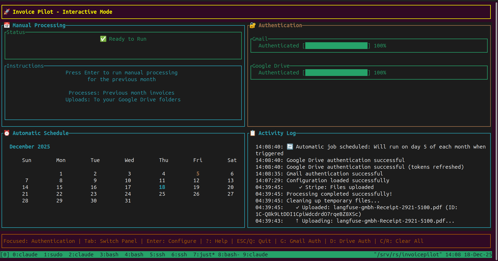

[](https://www.python.org)
[](https://fastapi.tiangolo.com)
[](https://vite.dev)
[](https://docker.com)
[](https://www.postgresql.org)

[](https://meetneura.ai) [](https://meetneura.ai) [](https://invoicepilot-f02dc983.88-198-24-98.sslip.io)

# Invoice Pilot

Automated invoice and bank statement management: pulls documents out of your
mailbox, extracts the fields, and organizes them. Free to use, modify and
distribute under the MIT License.



**Live dashboard:** <https://invoicepilot-f02dc983.88-198-24-98.sslip.io> — behind
basic auth, since the application has no login of its own (see [Putting it on
the internet](#putting-it-on-the-internet)). Share links under `/s/<token>` are
exempt and open to anyone holding the link.

> **Status.** Invoice Pilot was originally a Rust TUI. It is being rewritten as
> a Python backend with a web dashboard, and that rewrite is in progress — see
> [Current state](#current-state) for what actually runs today.

## Table of Contents

- [Current state](#current-state)
- [Layout](#layout)
- [Prerequisites](#prerequisites)
- [Setup](#setup)
- [Running](#running)
- [Configuration](#configuration)
- [Invoice extraction](#invoice-extraction)
- [Supported financial institutions](#supported-financial-institutions)
- [Development](#development)
- [Security notes](#security-notes)
- [Contributing](#contributing)
- [License](#license)

## Current state

Working today:

- **Dashboard** — React app listing stored invoices (vendor, amount, issued).
  **Update** scans whatever has arrived in every connected mailbox since it was
  last scanned through, and the table refreshes with whatever parsed. **Add
  source** runs the hosted Unipile wizard to connect a new mailbox.
- **Extraction pipeline** — mail through Unipile, `invoice2data` over
  attachments, forwarded `.eml` contents, message bodies and PDFs linked from
  a body. Shared by the API and `invoicepilot scan`.
- **Storage** — Postgres for the metadata the dashboard queries, plus
  `.data/<mailbox>/<date>__<vendor>__<amount>__<id>/` for the vendor's own
  document. Both are keyed identically, so re-scanning updates rather than
  duplicates.
- **API** — `/health`, `/accounts`, `/accounts/connect`, `/scan`,
  `/scan/{id}`, `/invoices`.
- **CLI** — `invoicepilot version`, `invoicepilot config`.

Not yet built: preview/download of a stored document, selection actions,
pagination, and sorting by column — the dashboard renders those controls but
they are inert. Not yet ported from the Rust version: Google Drive upload,
institution-based folder organization, scheduled runs and completion emails
(neither has been started).

## Layout

```
compose.yml       dev stack: postgres + dashboard
compose.prod.yml  deployed stack: postgres + api + dashboard
services/api/     the FastAPI service — package, tests, ops scripts, Dockerfile
services/web/     the dashboard — Vite app, Caddy config, Dockerfile
deploy/           host-level config that is not a container
tools/            dev tooling owned by no service
docs/             design notes and flow mockups
```

See [STRUCTURE.md](STRUCTURE.md) for the rules governing where new code goes.

## Prerequisites

- **Python 3.11+**
- **Node 20+** (only for the dashboard)
- **Just** — optional, see <https://github.com/casey/just#installation>
- **Docker** — only if you want the Postgres container
- A **Unipile** account (brokers the mailbox OAuth), or a Google Cloud project
  with the Gmail API enabled if you want to go direct

### Google Cloud setup (direct Gmail path only)

1. Go to [Google Cloud Console](https://console.cloud.google.com/) and create
   or select a project
2. Enable the **Gmail API** under "APIs & Services" > "Library"
3. Create OAuth2 credentials: "Credentials" > "Create Credentials" >
   "OAuth client ID", application type **Desktop app**
4. Save the **Client ID** and **Client Secret** into `.env`
5. Under "OAuth consent screen", add the scope
   `https://www.googleapis.com/auth/gmail.readonly`, and while the screen is in
   "Testing" mode add your own address under **Test users**
6. Add `http://localhost:57553` to the client's **Authorized redirect URIs**.
   It must byte-match `GOOGLE_GMAIL_REDIRECT_URI` — http not https, no trailing
   slash, no path.

Using Unipile instead means none of the above is needed; Unipile brokers the
provider OAuth and you only set `UNIPILE_API_KEY` and `UNIPILE_DSN`.

## Setup

```bash
cp services/api/.env.example services/api/.env   # backend credentials
cp .env.example .env                            # compose credentials
just setup                # creates .venv and installs services/api
source .venv/bin/activate

just start-db             # Postgres in Docker, port 57552
just migrate              # create tables, backfill anything already in .data/

just web-install          # npm install in services/web/
```

`just setup` uses `uv` if it is installed and falls back to `venv` + `pip`.
`just migrate` needs `DATABASE_URL` set and the database running.

## Running

```bash
just api                  # FastAPI on http://127.0.0.1:8000  (/health)
just web                  # dashboard on http://localhost:5173 (dev server)
just web-deploy           # dashboard on http://localhost:8090 (built, in Docker)
just cli config           # show resolved settings, secrets redacted
just test                 # pytest
just lint                 # ruff check + format --check
```

Without `just`:

```bash
cd services/api && uvicorn invoicepilot.app:api --reload
cd services/web && npm install && npm run dev
python -m invoicepilot --help
```

Run `just api` and `just web` together: the Vite dev server proxies `/api` to
the backend, so the dashboard calls same-origin paths and neither CORS config
nor a base-URL variable is needed.

`just web-deploy` is the same dashboard built and served by Caddy in a
container on port 8090, with the same same-origin `/api` (proxied to the host's
port 8000 rather than to Vite). The container holds a build, not the source, so
rerun it after a frontend change or 8090 goes on serving the previous bundle.
The API itself still runs on the host: only the dashboard is containerised.

A scan runs in a background thread and the dashboard polls it. A small mailbox
finishes in a few seconds, but the work is unbounded in principle — it
downloads every PDF attachment, runs invoice2data over each candidate document,
and by default follows invoice links out to the vendor's own servers with a 20s
timeout each. Pass `--no-follow-links` to the CLI (or `{"follow_links": false}`
to `POST /scan`) to keep a scan strictly offline.

### Containers

[compose.yml](compose.yml) holds the two services this project runs in Docker
while you develop, and the `.env` beside it holds their credentials — compose
reads both without any flags, because they sit together at the repo root.

```bash
just start-db             # postgres service, port 57552
just stop-db
just web-deploy           # web service, port 8090, rebuilding the image
just web-down
```

The API is deliberately not a service *here*. It runs on the host under
uvicorn, and the dashboard container's Caddy proxies `/api` to it through
`host.docker.internal`; containerising it would mean rebuilding an image on
every backend edit, and the reload loop is the point of running it locally.

## Deploying

[compose.prod.yml](compose.prod.yml) is the same application
with nothing left on the host: Postgres, the API and the dashboard are all
containers, and the dashboard's Caddy proxies `/api` across the compose network
instead of back out to `host.docker.internal`.

```bash
cp .env.example .env      # then fill in
just deploy               # build and start all three
just deploy-logs
just deploy-down
```

Two variables in `.env` decide whether the deploy is correct rather than
merely running. `POSTGRES_PASSWORD` is the database. `PUBLIC_BASE_URL` is the
origin share links are handed out under — it must be the public HTTPS address
of the *dashboard*, because a link opens the share page, which then calls
`/api/s/<token>` back on that same origin. It is baked into every link already
sent, so changing it later strands them.

The schema is created by the API container on startup (`invoicepilot migrate`,
which is a no-op the second time), so there is no separate migrate step: an
empty volume plus `just deploy` is the whole install. Extracted documents live
in the `invoicepilot-invoice-data` volume — real financial documents, and the
only copy.

### Putting it on the internet

Nothing in the stack binds a public interface: the dashboard is published on
`127.0.0.1:8090` and the API is not published at all. Something on the host has
to terminate TLS for the public hostname and proxy to that port.
[deploy/caddy-public.caddy](deploy/caddy-public.caddy) is that piece, written
for a host already running Caddy — copy it into the site directory, set the
hostname and a password hash, and reload:

```bash
cp deploy/caddy-public.caddy ~/serverkit/caddy/sites/invoicepilot.caddy
docker exec serverkit-caddy caddy reload --config /etc/caddy/Caddyfile
```

Without a domain, `sslip.io` resolves `<anything>.<dashed-ip>.sslip.io` to that
IP with no registration, which is enough for Let's Encrypt to issue.

That file also puts basic auth on the dashboard, and the reason is worth
keeping in mind if you remove it: this application has no login of its own, and
its API can read every extracted invoice, connect and disconnect mailboxes, and
send mail as them. Share links are exempt from the password — `/s/<token>`,
`/api/s/*` and `/assets/*` stay open, because a recipient has no account and
the whole product is that they need none.

## Configuration

The api service's settings come from `services/api/.env`, read by
[services/api/src/invoicepilot/core/config.py](services/api/src/invoicepilot/core/config.py).
Every key it reads is documented in
[services/api/.env.example](services/api/.env.example). The containers' own
settings are a separate `.env` at the repo root, documented in
[.env.example](.env.example) — the same credential appears in both, because the
API runs on the host in development and in a container when deployed.

Keys carried over from the Rust binary that nothing reads yet (Drive upload,
scheduling, keyword filters, Wise, notification email) are listed at the bottom
of `.env.example`, commented out and marked as such.

## Invoice extraction

```bash
invoicepilot scan --help          # incremental: whatever is new since last time
invoicepilot scan --since 2026-01-01   # work through history, or re-parse a range
invoicepilot scan --no-keywords        # read everything, not just invoice-ish mail
```

A scan covers each mailbox from where the last one left off. A mailbox nobody
has scanned before reaches 60 days back, and mail is prefiltered to messages
whose text looks like an invoice — see `INVOICE_KEYWORDS` in `process.py`.

Documents are matched against `invoice2data` templates: 215 built-in ones, plus
any YAML you add under
[services/api/src/invoicepilot/templates/invoice2data/](services/api/src/invoicepilot/templates/invoice2data/),
which is auto-loaded. Point `--templates` elsewhere to override.

Recognition is per-issuer, so an invoice from a vendor with no template looks
like an ordinary email. The templates that ship here are the ones the built-ins
missed:

| Template | Reads |
| --- | --- |
| `stripe_receipt_email.yml` | the receipt mail Stripe sends for a vendor |
| `stripe_invoice_pdf.yml` | the PDF behind its "Download invoice" link |
| `bolt_ride_receipt.yml` | a Bolt ride receipt, in the mail body |
| `bolt_invoice_bg.yml` | Bolt's own invoice PDF, in Bulgarian |
| `telekom_hotspot.yml` | Telekom's HotSpot receipt |
| `vp_consulting.yml` | ВИ ПИ ПАРТНЪРС ООД's monthly accounting invoice |

The two Stripe ones are not per-vendor: they capture the issuer from the
document, so they cover every vendor Stripe bills for. Adding a template is the
cheapest way to widen coverage — drop a YAML file in and the next scan picks it
up, with `tests/test_templates.py` as the pattern for covering it.

### Teaching itself an issuer

A message that parses to nothing is ambiguous: either it is not an invoice, or
it is one from an issuer nobody has written a template for. `gate.py` separates
the two without calling anything — a total-shaped label next to a figure, a PDF
attachment, or a sender like `receipts@`/`invoicing@`. Measured against 162 real
messages, 94% of the invoices pass and 5 of 126 non-invoices do.

For what passes the gate and still parses to nothing, a scan asks Claude to
write the template — **once per sending domain, for the life of that domain**,
at roughly five cents a time. Set `ANTHROPIC_API_KEY` to turn it on; without one
everything else works unchanged and unknown issuers are simply reported.

What the model returns is a template, never an invoice: it is asked where the
fields are, not what they say. Every figure in the database is still extracted
by regex from a YAML file you can read, and re-parsing an old invoice calls
nothing. A draft is kept only if it reproduces the document it was written from
and reads an amount that document actually states; otherwise it is discarded and
the domain marked so the next scan does not pay to fail the same way.

Kept templates land in `<data_dir>/templates/`, carry `priority: 1` so they can
never outrank a hand-written one, and are unreviewed until you move them into
`templates/invoice2data/` yourself. Run `invoicepilot scan --no-learn` to keep a
scan entirely offline of any model.

Recognised invoices are written under `.data/`, one directory per invoice
holding `invoice.json`, the original `invoice.pdf` (when there was an
attachment) and `source.html`. **`.data/` is gitignored** — it holds real
financial documents.

## Supported financial institutions

Detection covers digital banks (Wise, Revolut, Nubank, Bunq, Monzo, Starling,
Chime), traditional banks (Santander, BBVA, CaixaBank, ING, Deutsche Bank, HSBC,
Barclays and most major European banks), brokerages (Interactive Brokers,
Charles Schwab, E\*TRADE, TD Ameritrade, Fidelity, Robinhood, Webull), crypto
exchanges (Coinbase, Binance, Kraken) and payment processors (Stripe, PayPal,
Adyen, Mollie).

> This detection logic lived in the Rust binary and has **not** been ported yet.
> It is documented here as the target behaviour, not as a current feature.

## Development

```bash
just test                 # pytest
just lint                 # ruff check + ruff format --check
just fmt                  # apply autofixes and formatting
just clean                # drop venv, caches, frontend build output
```

There is no CI. `just lint` and `just test` before a commit are the whole
gate, so they are worth actually running.

One thing to know about `just test`: the workspace isolation tests — that one
browser cannot read another's invoices — need a real Postgres and **skip
silently without one**. They are the tests that cover the only security
boundary this app has, so run them against a database before changing anything
about workspaces, shares or scoping:

```bash
just start-db                                          # or any Postgres
DATABASE_URL=postgresql+psycopg://…/invoicepilot_test just test
```

Watch the skip count. `57 passed, 24 skipped` means they did not run.

## Security notes

- Never commit `.env` or extracted documents; both are gitignored
- `.data/` contains real invoices — treat it as sensitive
- OAuth callbacks are loopback-only
- All provider API calls use HTTPS

## Contributing

1. **Fork** the repository on GitHub
2. **Branch**: `git checkout -b feature/amazing-feature`
3. **Make your changes**, following [STRUCTURE.md](STRUCTURE.md) for placement
   and adding tests where applicable
4. **Check**: `just lint && just test`
5. **Commit**: `git commit -m 'feat: add amazing feature'`
6. **Open a Pull Request** describing the change

Useful places to start: porting the Drive upload and institution-detection
logic, defining the dashboard's API endpoints in
`services/api/src/invoicepilot/schemas.py`, adding
`invoice2data` templates for vendors that don't parse yet, or widening test
coverage.

Report bugs via the GitHub issue tracker with steps to reproduce, expected
behaviour and actual behaviour.

## License

MIT — see [LICENSE](LICENSE). Completely free to use, modify and distribute for
any purpose.
